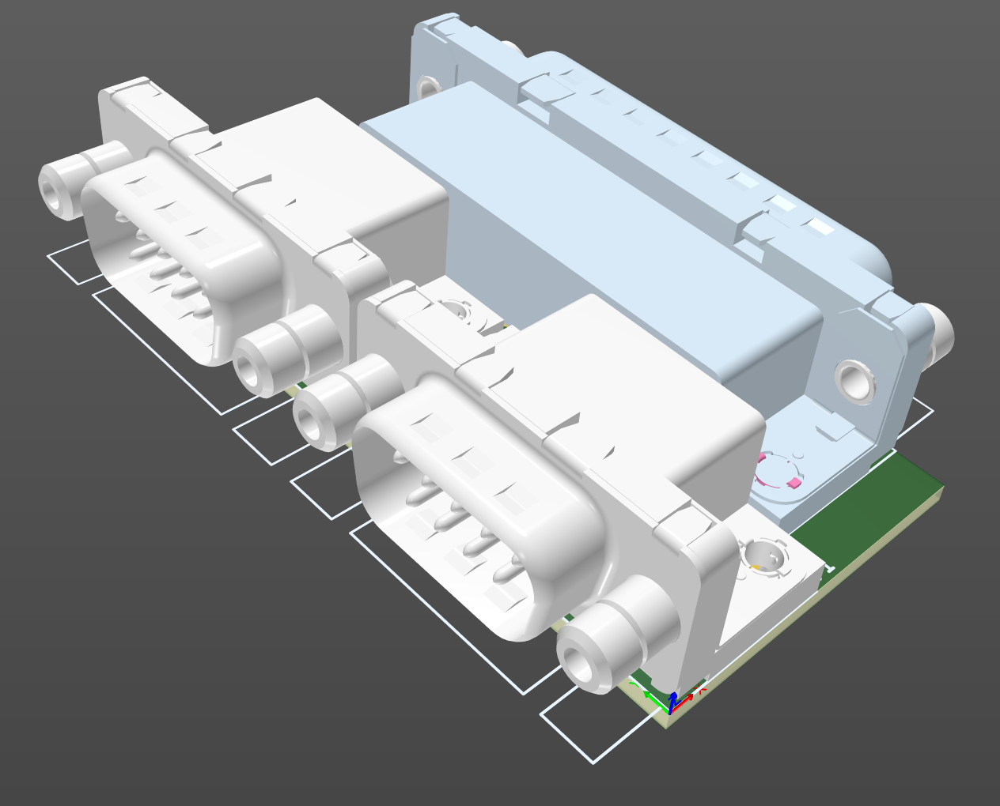

# Ian Haylock Parallel Joystick

April 2025

A re-creation of Ian Haylock's design for a dual Atari/Commodore joystick adapter for the parallel port that will work even on machines with uni-directional parallel ports such as Acorn A3xx/A4xx/A540/A3000 as it only uses the BUSY input status signal for input.

This has been re-created previously by !FOZ! - I just decided to create my own layout, primarily for a smaller PCB.
!FOZ!'s StarDot thread : https://stardot.org.uk/forums/viewtopic.php?t=24492

## Licence

No warranty is provided, and this work is used at your own risk.

(C) Ian Haylock 1993

Based on work by !FOZ!, 2022

Licenced as CC BY-SA 4.0

Copyright 2025 Ian Jeffray
